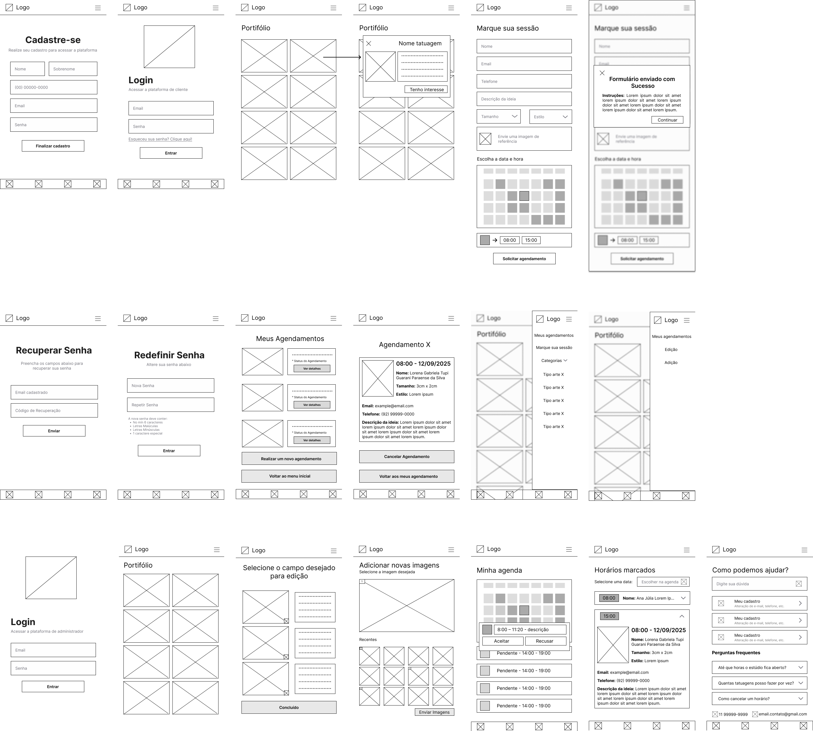
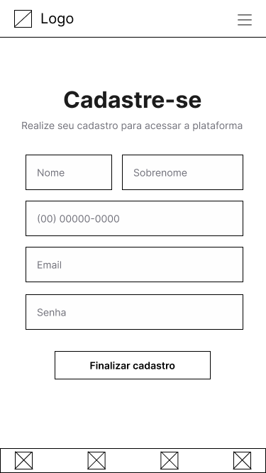
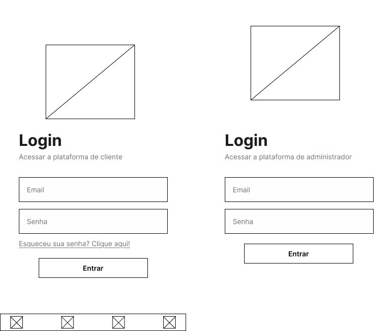
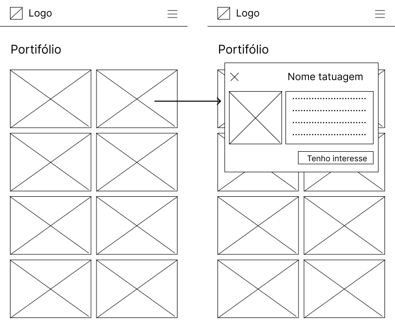
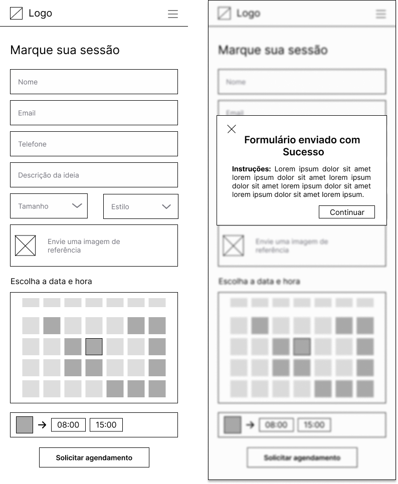
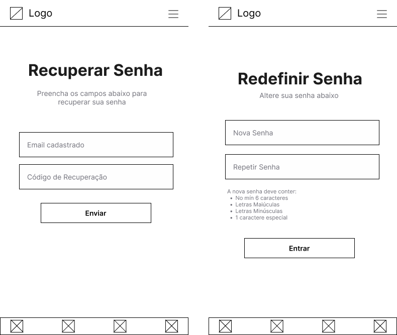
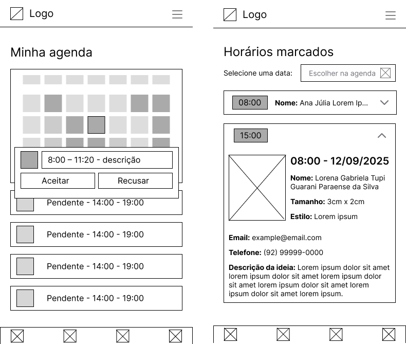
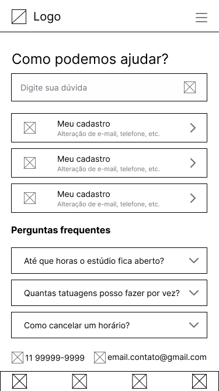
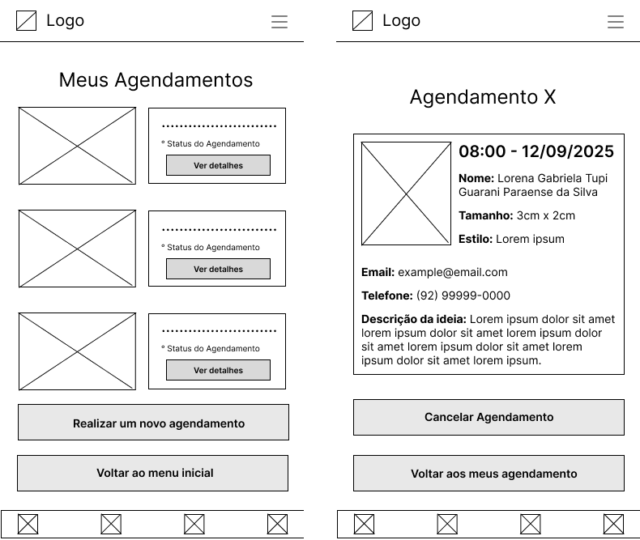

# 🎨 Design

<!-- Este documento deve ser preenchido pela área de Design assim que o projeto for repassado pela área de Visão de Produto. -->

## 🗓 Informações Gerais

- **Nome do Projeto:** 
Tattoo Studio — Sistema de Portfólio e Agendamento

- **Responsável de Design:**
Isabela Szolnoky Ferreira Cabral Souza da Conceição

- **Data de Entrada no Design:**
08/08/2025

- **Data de Entrega Estimada para Desenvolvimento:**
2 semanas

- **Link para Documento de Visão de Produto:**
https://github.com/Inteli-Junior/Trainee-2025.2/blob/docs/intro-visao-produto/docs/docs/visao-produto.md

---

## ✅ Checklist de Entrada (antes de iniciar o design)

- [x] Documento de Visão de Produto recebido e validado
- [x] Escopo e funcionalidades compreendidos
- [x] Personas identificadas
- [x] Alinhamento com PO realizado
- [x] Capacidade da equipe verificada
- [x] Deadline estabelecido

---

## 📤 Checklist de Saída (antes de repassar para Desenvolvimento)

- [x] Wireframes
- [ ] Protótipo final validado pelo cliente
- [ ] Layouts organizados no Figma
- [ ] Especificações visuais claras (cores, tamanhos, espaçamentos)
- [ ] Responsividade definida
- [ ] Assets entregues (logos, imagens, ícones)

---

## 🎯 Objetivo do Design

Criar uma interface moderna, visual e intuitiva que destaque o portfólio do tatuador de forma organizada por estilos.
O design deve transmitir profissionalismo e criatividade, refletindo a identidade artística do cliente e gerando confiança nos visitantes.
A experiência precisa ser fluida e responsiva, permitindo que clientes naveguem facilmente pelo portfólio e solicitem agendamentos sem complicações.

---

## 🖼 Wireframes
---

  FIGURA 1 - Wireframes 
   
  Fonte: Material produzido pelos autores, 2025

---
### Cadastro
&emsp; A tela de cadastro apresenta campos claros para nome, sobrenome, telefone, e-mail e senha, garantindo uma experiência simples e intuitiva para novos usuários. O botão “Finalizar cadastro” está destacado, enquanto o cabeçalho com logo e o rodapé com ícones de navegação mantêm a consistência visual. O design foca na clareza e no preenchimento rápido das informações necessárias.

    
<strong>Figura 2</strong> – Tela de cadastro

    
    

        Fonte: Material produzido pelos autores, 2025.
    

  

---
### Login
&emsp; Os designs de login são padronizados para clientes e administradores. Cada tela solicita e-mail e senha, criados no cadastro, com botão “Entrar” visível e a logo no topo. Há também a opção de recuperar a senha para facilitar o acesso. O layout é limpo e consistente entre os diferentes tipos de usuário, reforçando a identidade visual da solução.

    
<strong>Figura 3</strong> – Telas de login

    
    

        Fonte: Material produzido pelos autores, 2025.
    

    

---
### Entrada
&emsp; As telas de entrada apresentam um portfólio organizado em grade, exibindo imagens de trabalhos/tatuagens. Ao clicar em uma imagem, abre-se uma visualização detalhada com nome do artista, descrição e um botão de “Tenho interesse”. O cabeçalho com a logo e a opção de abrir a barra de navegação lateral garantem acesso rápido às outras áreas do sistema, enquanto o rodapé mantém a padronização do layout.

    
<strong>Figura 4</strong> – Telas de Página de entrada (foto e detalhes)

    
    

        Fonte: Material produzido pelos autores, 2025.
    

    

---
### Formulário e confirmação de envio
&emsp; O formulário de agendamento é estruturado para solicitar nome, e-mail, telefone, descrição da ideia, tamanho e estilo, além de permitir o envio de uma imagem de referência. O usuário escolhe data e horário em um calendário interativo e confirma o envio. Após o envio bem-sucedido, a tela de confirmação exibe uma mensagem clara de sucesso e um botão para voltar ou continuar, transmitindo feedback imediato e segurança ao usuário.

    
<strong>Figura 5</strong> – Telas de Formulário e confirmação de envio

    
    

        Fonte: Material produzido pelos autores, 2025.
    

    

---
### Recuperação de senha
&emsp; A recuperação de senha é dividida em duas etapas:

- Tela 4: o usuário insere o e-mail para receber um código de recuperação e informa o código.

- Tela 4.1: o usuário redefine a senha informando a nova credencial.

  O processo é direto e visualmente alinhado às outras telas, com botões destacados e cabeçalho padronizado.

    
<strong>Figura 6</strong> – Telas de Página de edição de perfil

    
    

        Fonte: Material produzido pelos autores, 2025.
    

    

---
### Páginas do administrador (inicial, edição e adição)
&emsp; As telas do administrador mantêm um portfólio em grade (tela 5) e oferecem ferramentas para edição (tela 5.1) e adição de novas imagens (tela 5.2). A edição permite selecionar campos específicos para atualização de informações, enquanto a adição possibilita o upload de imagens com visualização prévia. O layout segue o padrão do sistema, garantindo facilidade de navegação e consistência visual.

    
<strong>Figura 7</strong> – Telas do administrador (inicial, edição e adição)

    
    

        Fonte: Material produzido pelos autores, 2025.
    

    

---
### Agenda e respostas do formulário
&emsp; A tela “Minha agenda” apresenta horários livres, pendentes e aceitos, facilitando o gerenciamento. A tela de respostas detalhadas (6.1) exibe informações completas do agendamento, incluindo data, horário, cliente, descrição e dados de contato, além de botões para aceitar ou recusar. A estrutura garante acesso rápido às informações relevantes e ações administrativas claras.

    
<strong>Figura 8</strong> – Telas de agenda e respostas do formulário

    
    

        Fonte: Material produzido pelos autores, 2025.
    

    

---
### FAQ
&emsp; A seção FAQ oferece uma barra de pesquisa para dúvidas rápidas e uma lista de perguntas frequentes organizadas em categorias. O design é intuitivo e prioriza a facilidade de encontrar respostas, com cada item expansível para exibir detalhes.

    
<strong>Figura 9</strong> – Tela de FAQ

    
    

        Fonte: Material produzido pelos autores, 2025.
    

    

---
### Agendamentos
&emsp; As telas de agendamentos exibem os compromissos já marcados e os detalhes individuais de cada agendamento. O usuário pode realizar um novo agendamento ou cancelar um existente. As informações do agendamento são apresentadas de forma clara, incluindo local, data, horário e artista responsável, promovendo confiança e organização.

    
<strong>Figura 10</strong> – Telas de agendamentos

    
    

        Fonte: Material produzido pelos autores, 2025.
    

    

---
### Barra de navegação
&emsp; A barra de navegação lateral exibe categorias e opções principais (meus agendamentos, categorias, tipos de arte, edição, adição), acessíveis a partir do menu hambúrguer no cabeçalho. O design garante usabilidade simplificada, permitindo ao usuário alternar entre seções rapidamente sem comprometer a experiência visual.

    
<strong>Figura 11</strong> – Telas de navegação

    
    

        Fonte: Material produzido pelos autores, 2025.
    

    

[Link para o Figma para melhor visualização](https://www.figma.com/design/egWyWhyEl9h5k3m8SWfhL7/Trainee--IJ?node-id=1-2&t=lHBRQY3XGq65AsTg-1)

**Link para protótipo (Figma, Excalidraw, etc):**
<!-- Exemplo: https://figma.com/projeto-reservas -->

---

## 🖌 Identidade Visual

### 🅰️ Tipografia

- **Fonte Primária:** 
Inter

<!-- - **Fonte Secundária (se houver):** -->
<!-- Exemplo: Roboto Mono -->

- **Tamanhos padrão:**
  - Títulos: 32px / Bold
  - Subtitulo: 24px / Regular
  - Texto: 16px / Regular
  - Notas secundárias: 14px / Light

---

### 🎨 Paleta de Cores

- **Cor Primária:** `#003366` <!-- Exemplo: Azul escuro -->
- **Cor Secundária:** `#F4A261` <!-- Exemplo: Laranja suave -->
- **Cor de Fundo:** `#FFFFFF`
- **Texto Principal:** `#333333`
- **Feedback positivo:** `#2A9D8F`
- **Feedback negativo:** `#E76F51`

<!-- Pode-se adicionar um print ou link para o sistema de design no Figma -->

---

### 🧩 Estilo de Ícones

- [ ] Filled
- [ ] Outlined
- [ ] Duotone
- [ ] Outro (especifique): ____________

**Fonte dos ícones:**
<!-- Exemplo: Lucide, Feather Icons, Material Symbols, etc -->

---

## 🧼 Limitações e Restrições Visuais

<!-- Alguma exigência por parte do cliente? Algo que deve ser evitado (ex: "sem imagens", "evitar uso de ícones", etc)? -->

<!-- 
**Exemplo:**
Cliente não quer o uso de imagens de pessoas reais. Todo o visual deve ser baseado em formas, ícones e cores neutras. 
-->

---

## 🖼 Protótipo

**Link para protótipo navegável (Figma, Adobe XD, etc):**
<!-- Exemplo: https://figma.com/projeto-reservas -->

**Observações sobre navegação e testes:**
<!-- Exemplo: A tela de confirmação de reserva ainda será validada com o cliente -->

---

## 📱 Responsividade

**O design contempla os seguintes formatos?**

- [x] Mobile
- [ ] Tablet
- [ ] Desktop
- [ ] Outros: ____________

**Observações:**
<!-- Exemplo: Algumas tabelas estão otimizadas apenas para tablet e desktop. -->

---

## 📌 Observações Finais

Cliente deseja solução em até 1 semana.

---

