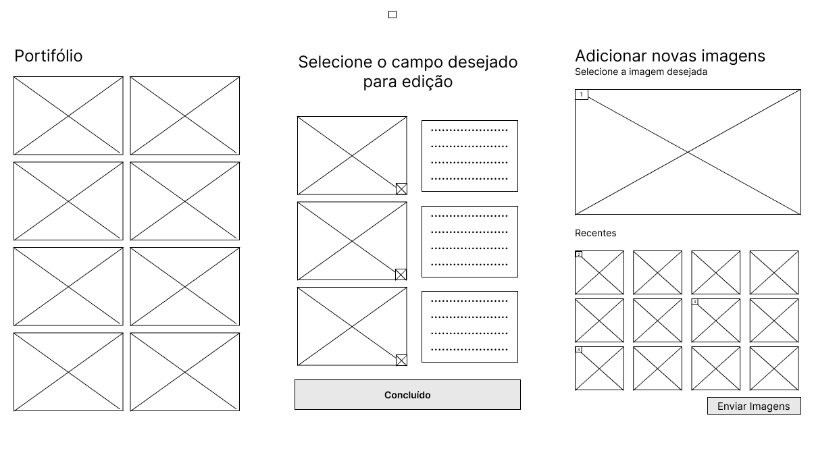
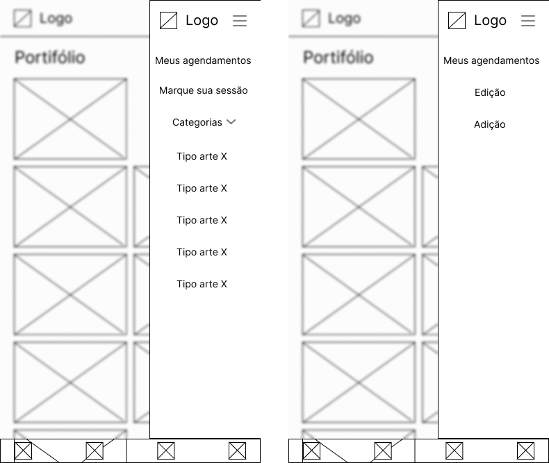

# 🎨 Design

<!-- Este documento deve ser preenchido pela área de Design assim que o projeto for repassado pela área de Visão de Produto. -->

## 🗓 Informações Gerais

- **Nome do Projeto:** 
Tattoo Studio — Sistema de Portfólio e Agendamento

- **Responsável de Design:**
Isabela Szolnoky Ferreira Cabral Souza da Conceição

- **Data de Entrada no Design:**
08/08/2025

- **Data de Entrega Estimada para Desenvolvimento:**
2 semanas

- **Link para Documento de Visão de Produto:**
https://github.com/Inteli-Junior/Trainee-2025.2/blob/docs/intro-visao-produto/docs/docs/visao-produto.md

---

## ✅ Checklist de Entrada (antes de iniciar o design)

- [x] Documento de Visão de Produto recebido e validado
- [x] Escopo e funcionalidades compreendidos
- [x] Personas identificadas
- [x] Alinhamento com PO realizado
- [x] Capacidade da equipe verificada
- [x] Deadline estabelecido

---

## 📤 Checklist de Saída (antes de repassar para Desenvolvimento)

- [x] Wireframes
- [ ] Protótipo final validado pelo cliente
- [ ] Layouts organizados no Figma
- [ ] Especificações visuais claras (cores, tamanhos, espaçamentos)
- [ ] Responsividade definida
- [ ] Assets entregues (logos, imagens, ícones)

---

## 🎯 Objetivo do Design

Criar uma interface moderna, visual e intuitiva que destaque o portfólio do tatuador de forma organizada por estilos.
O design deve transmitir profissionalismo e criatividade, refletindo a identidade artística do cliente e gerando confiança nos visitantes.
A experiência precisa ser fluida e responsiva, permitindo que clientes naveguem facilmente pelo portfólio e solicitem agendamentos sem complicações.

---

## 🖼 Wireframes

  FIGURA 1 - Wireframes 
   
  Fonte: Material produzido pelos autores, 2025

Acima apresentamos o painel geral de telas utilizadas pelo cliente, desde o cadastro até a finalização do atendimento com a finalização do formulário de agendamento.

  FIGURA 2 - Tela 1 – Cadastro 
   
  Fonte: Material produzido pelos autores, 2025

  FIGURA 3 - Telas 1.1 e 1.2 – Login (Cliente e Administrador) 
   
  Fonte: Material produzido pelos autores, 2025

  FIGURA 4 - Telas 2 e 2.1 – Página de entrada (foto e detalhes) 
   
  Fonte: Material produzido pelos autores, 2025

  FIGURA 5 - Telas 3 e 3.1 – Formulário e confirmação de envio 
   
  Fonte: Material produzido pelos autores, 2025

  FIGURA 6 - Tela 4 – Página edição de perfil 
   
  Fonte: Material produzido pelos autores, 2025

  FIGURA 7 - Telas 5, 5.1 e 5.2 – Páginas do administrador (inicial, edição e adição) 
   
  Fonte: Material produzido pelos autores, 2025

  FIGURA 8 - Telas 6 e 6.1 – Minha agenda e respostas do formulário 
   
  Fonte: Material produzido pelos autores, 2025

  FIGURA 9 - Tela 7 – Página de contato/ajuda 
   
  Fonte: Material produzido pelos autores, 2025

  FIGURA 10 - Telas 8 e 9 – Meus agendamentos e agendamento 
   
  Fonte: Material produzido pelos autores, 2025

  FIGURA 11 - Navbar – Barra de navegação 
   
  Fonte: Material produzido pelos autores, 2025

[Link para o Figma para melhor visualização](https://www.figma.com/design/egWyWhyEl9h5k3m8SWfhL7/Trainee--IJ?node-id=1-2&t=lHBRQY3XGq65AsTg-1)

**Link para protótipo (Figma, Excalidraw, etc):**
<!-- Exemplo: https://figma.com/projeto-reservas -->

---

## 🖌 Identidade Visual

### 🅰️ Tipografia

- **Fonte Primária:** 
Inter

<!-- - **Fonte Secundária (se houver):** -->
<!-- Exemplo: Roboto Mono -->

- **Tamanhos padrão:**
  - Títulos: 32px / Bold
  - Subtitulo: 24px / Regular
  - Texto: 16px / Regular
  - Notas secundárias: 14px / Light

---

### 🎨 Paleta de Cores

- **Cor Primária:** `#003366` <!-- Exemplo: Azul escuro -->
- **Cor Secundária:** `#F4A261` <!-- Exemplo: Laranja suave -->
- **Cor de Fundo:** `#FFFFFF`
- **Texto Principal:** `#333333`
- **Feedback positivo:** `#2A9D8F`
- **Feedback negativo:** `#E76F51`

<!-- Pode-se adicionar um print ou link para o sistema de design no Figma -->

---

### 🧩 Estilo de Ícones

- [ ] Filled
- [ ] Outlined
- [ ] Duotone
- [ ] Outro (especifique): ____________

**Fonte dos ícones:**
<!-- Exemplo: Lucide, Feather Icons, Material Symbols, etc -->

---

## 🧼 Limitações e Restrições Visuais

<!-- Alguma exigência por parte do cliente? Algo que deve ser evitado (ex: "sem imagens", "evitar uso de ícones", etc)? -->

<!-- 
**Exemplo:**
Cliente não quer o uso de imagens de pessoas reais. Todo o visual deve ser baseado em formas, ícones e cores neutras. 
-->

---

## 🖼 Protótipo

**Link para protótipo navegável (Figma, Adobe XD, etc):**
<!-- Exemplo: https://figma.com/projeto-reservas -->

**Observações sobre navegação e testes:**
<!-- Exemplo: A tela de confirmação de reserva ainda será validada com o cliente -->

---

## 📱 Responsividade

**O design contempla os seguintes formatos?**

- [x] Mobile
- [ ] Tablet
- [ ] Desktop
- [ ] Outros: ____________

**Observações:**
<!-- Exemplo: Algumas tabelas estão otimizadas apenas para tablet e desktop. -->

---

## 📌 Observações Finais

Cliente deseja solução em até 1 semana.

---

