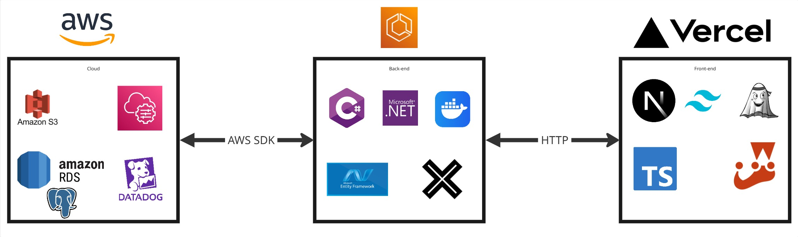

# ⚙️ Tecnologias

## 🗓 Informações Gerais

- **Nome do Projeto:**
Tattoo Studio — Sistema de Portfólio e Agendamento

- **Tech Lead:**
Davi Duarte Rodrigues

- **Data de Entrada na Área:**
10/09/2025

- **Data Estimada de Conclusão da Área:**
06/10/2025

- **Link para Documento de Visão de Produto:**
https://github.com/Inteli-Junior/Trainee-2025.2/blob/main/docs/docs/visao-produto.md

## Checklist de Entrada e Saída da Área de Tecnologia

### ✅ Checklist de Entrada

- [X] Documento de Visão de Produto validado

### 📤 Checklist de Saída

- [X] Stack definida e aprovada
- [X] Diagrama de arquitetura completo
- [X] Plano de implantação claro
- [X] Documento validado com o time de Desenvolvimento

## Stack Tecnológica

### Frontend

- Linguagem principal: TypeScript
- Framework/Biblioteca: Next.JS
- Ferramentas adicionais: TailwindCSS + Vite (webpacker)
- Justificativa da escolha: O uso de TypeScript garante maior segurança no desenvolvimento com tipagem estática, reduzindo bugs em produção. O Next.JS foi escolhido por oferecer SSR (Server Side Rendering) e SSG (Static Site Generation), otimizando SEO, desempenho e experiência do usuário. O TailwindCSS agiliza a construção de interfaces responsivas e consistentes, mantendo a padronização visual. Já o Vite substitui o webpack convencional, proporcionando builds e hot reload extremamente rápidos, o que aumenta a produtividade no desenvolvimento.

### Backend

- Linguagem: C#
- Framework: .NET
- ORM (se aplicável): Entity Framework
- Estratégia de autenticação/autorização: JWT (JSON Web Tokens) integrado ao .NET Identity
- Justificativa da escolha: A stack C# + .NET oferece alta performance, maturidade e escalabilidade para aplicações corporativas, além de um ecossistema robusto para integrações. O Entity Framework simplifica o acesso e mapeamento de dados, permitindo produtividade sem perder flexibilidade. O uso de JWT garante autenticação e autorização seguras em APIs distribuídas e aplicações modernas.

### Banco de Dados

- Tipo (relacional/não-relacional): Relacional
- Tecnologia: AWS RDS com PostgreSQL
- Justificativa da escolha: A escolha do AWS RDS com PostgreSQL combina a robustez e os recursos avançados do PostgreSQL (como suporte a JSONB, índices eficientes e transações complexas) com a praticidade de um serviço gerenciado. O RDS oferece alta disponibilidade, backups automáticos, replicação e escalabilidade vertical/horizontal, reduzindo a sobrecarga operacional da equipe e garantindo consistência e performance em produção.

### Diagrama do Banco de Dados

O modelo de dados foi estruturado com base nos requisitos do sistema e representa de forma clara as entidades principais, atributos e relacionamentos.  
O diagrama foi desenvolvido no **draw.io** e serve como documentação visual para facilitar a comunicação entre equipe de desenvolvimento e stakeholders.  

### Outras Tecnologias

- Docker (DevOps): garante portabilidade e consistência entre ambientes de desenvolvimento, homologação e produção.

- Bucket S3 (Storage): solução escalável e de baixo custo da AWS para armazenamento de arquivos e assets estáticos.

- Datadog (Monitoramento e Logs): oferece observabilidade completa, facilitando a identificação de gargalos de performance e erros em produção.

- Jest & xUnit/NUnit (Testes): permitem a automação de testes unitários e de integração, garantindo qualidade e confiabilidade contínua do software.

- AWS SSM / Secrets Manager (Gestão de segredos): utilizado para armazenar credenciais de banco de dados, chaves JWT e acessos à AWS de forma segura, com rotação automática e eliminação de hardcode no código-fonte.

- bcrypt (Criptografia de senhas): garante hashing seguro de senhas e tokens sensíveis antes do armazenamento no banco, reforçando a proteção contra ataques de brute force e vazamentos de dados.

- Justificativa da escolha:
Essas ferramentas foram selecionadas para fortalecer a manutenibilidade, qualidade e escalabilidade do sistema. Enquanto Docker e S3 asseguram infraestrutura estável e flexível, Datadog fornece monitoramento proativo e suporte à tomada de decisão baseada em métricas. Já os testes automatizados com Jest e xUnit/NUnit aumentam a confiabilidade das entregas, acelerando o ciclo de desenvolvimento.

## Arquitetura da Solução

### Visão Geral da Arquitetura

O sistema utiliza uma arquitetura MVC orientada a serviços, com back-end rodando em C# com .NET e front-end baseado em TypeScript com NextJS. Para deploy nos ambientes de desenvolvimento e produção, utilizamos docker para conteinerização e AWS como plataforma de cloud.

O back-end roda em uma instância ECS da AWS (Amazon Elastic Container Service), enquanto o deploy do front-end é feito em Vercel para uma redução de custos. Os sistemas de armazenamento e banco de dados funcionam em nuvem com os serviços de Bucket do S3 (Simple Storage System) e RDS (Relational Database System) da AWS, respectivamente. Para o envio de e-mails de recuperação de senha e validação de conta, utilizamos o SES (AWS Simple E-mail Service).

### Componentes Principais
- AWS ECS
- AWS RDS
- AWS S3
- Back-end em .NET
- Front-end em NextJS
- Datadog

### Diagrama da Arquitetura (opcional)

## Estrutura de Implantação

### Ambiente de Desenvolvimento
- **Como os devs devem subir localmente:** via Docker Compose, utilizando containers para backend, frontend e banco de dados.  
- **Docker/Compose disponível?:** Sim, com arquivos `Dockerfile` e `docker-compose.yml` versionados no repositório.  
- **Variáveis de ambiente principais:**  
  - `DATABASE_URL` (PostgreSQL)  
  - `JWT_SECRET` (chave de assinatura dos tokens)  
  - `AWS_ACCESS_KEY_ID` / `AWS_SECRET_ACCESS_KEY` (credenciais para S3 e Secrets Manager)  
  - `DATADOG_API_KEY` (monitoramento)  

### Ambiente de Produção
- **URL:** `https://tattoostudio.app` 
- **Estratégia de deploy:** Blue/Green para evitar downtime em atualizações críticas.  
- **Infraestrutura:** AWS (ECS para containers, RDS para banco, S3 para assets, CloudFront como CDN).  
- **Ferramentas de observabilidade ativas:** Datadog (métricas, logs, tracing) + monitoramento nativo da AWS (CloudWatch).  

### Diagrama de Implantação (opcional)
> Diagrama com servidores, buckets, serviços gerenciados, DNS, CDNs, etc.

## Considerações de Segurança

- Políticas de CORS: Será configurado no backend .NET para aceitar apenas requisições oriundas do domínio do frontend Next.JS em produção. Em ambiente de desenvolvimento, o CORS será flexibilizado para permitir localhost em portas específicas, mas nunca aberto de forma irrestrita `(*)`.

- Proteção de dados sensíveis: Todas as comunicações entre cliente e servidor ocorrerão via HTTPS. Dados sensíveis (como senhas e tokens) serão armazenados com hash seguro via bcrypt. Informações críticas armazenadas no PostgreSQL serão criptografadas, e dados que aparecerem em logs serão mascarados para evitar vazamentos.

- Gestão de segredos:
As credenciais do banco de dados, chaves JWT e acessos ao AWS S3 não ficarão hardcoded no repositório. Elas serão gerenciadas através do AWS Secrets Manager (SSM) e injetadas como variáveis de ambiente no container Docker em tempo de execução.

- Autenticação e autorização:
O sistema utilizará JWT integrado ao .NET Identity, emitido no momento do login. O token conterá roles e claims, permitindo controle granular de acesso às rotas da API. O frontend Next.JS validará a expiração do token antes de cada requisição crítica.